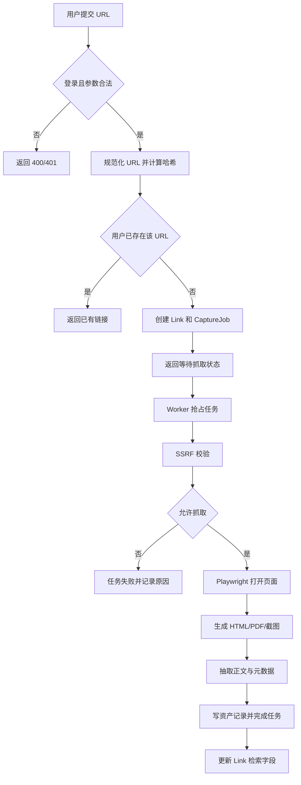
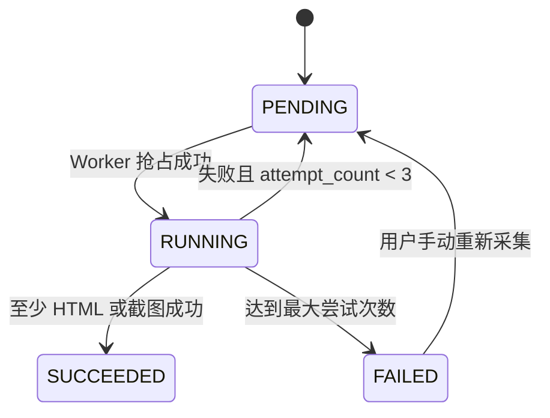
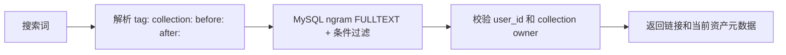

# 业务与系统流程

## 保存链接流程

## 任务状态机

## 重试与恢复

- Worker 抢占任务时写入 `locked_by` 和 `locked_until`。
- 每次失败记录错误码和可读错误信息。
- 第 1、2 次失败分别等待 30 秒、120 秒；第 3 次失败标记为 `FAILED`。
- 定时扫描超过锁定时间仍为 `RUNNING` 的任务，将其恢复为 `PENDING`。
- 重新采集创建新 Job，旧资产保留；新 Job 全部成功后更新当前展示版本。

## 搜索流程

## 失败场景

- URL 无法解析或指向私网：不进入浏览器，直接记录 `UNSAFE_URL`。
- 页面超时：终止浏览器操作，按普通失败重试。
- PDF 或 HTML 单格式失败：保留已成功资产，任务可标记部分成功。
- Worker 崩溃：锁过期后任务重新可见。
- 文件写入失败：事务中的资产记录不提交，任务进入重试。

