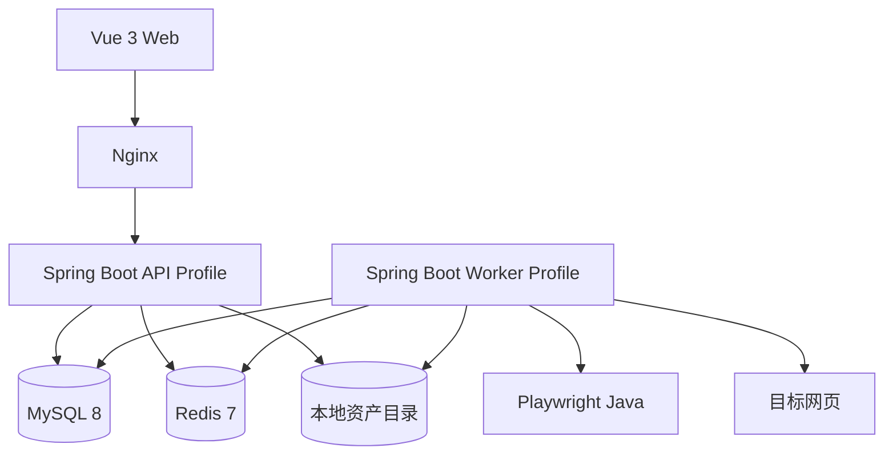

# 技术选型与架构

## 技术选型

- 语言与运行时：Java 17。
- Web 框架：Spring Boot 3.x、Spring MVC、Bean Validation。
- 数据访问：MyBatis-Plus，复杂 SQL 使用 XML 或 Mapper 注解手写。
- 鉴权：Sa-Token + JWT，密码使用 BCrypt。
- 数据库：MySQL 8，InnoDB，utf8mb4。
- 缓存与协作：Redis 7，用于登录会话辅助、限流和短时分布式锁。
- 网页采集：Playwright Java、Jsoup。
- 前端：Vue 3、Vite、Pinia、Vue Router、Element Plus。
- 构建：Maven 多模块或单模块分层，前端 npm。
- 部署：Docker Compose + Nginx。

## 不选方案

- 不选微服务：当前只有一个业务域和一个团队，拆分只会增加部署和排错成本。
- 不选 RabbitMQ：任务量小，MySQL 任务表足以提供持久化、重试和可见性。
- 不选 Redis Stream 作为第一版事实队列：任务状态仍需要数据库审计，单独维护两套状态更容易不一致。
- 不选 MinIO：单机文件系统足够；通过 `AssetStorage` 接口保留替换能力。
- 不选 Meilisearch：第一版使用 MySQL ngram 全文索引，减少一个同步组件。
- 不选 JPA：MyBatis-Plus 更贴近当前学习经验，复杂抢占 SQL 更直观。

## 逻辑架构



API 和 Worker 使用同一后端代码库，但以不同 profile 启动：

- `api`：只启用 Controller、鉴权、事务和查询。
- `worker`：只启用任务调度、Playwright 和资产生成，不开放业务 API。

## 后端模块

- `auth`：注册开关、登录、退出、当前用户。
- `collection`：默认 Inbox、集合 CRUD、所有权检查。
- `link`：链接 CRUD、URL 规范化、去重和重新采集。
- `tag`：标签 CRUD 和链接关联。
- `capture`：任务创建、抢占、状态机、重试和恢复。
- `asset`：资产元数据、文件存储和读取鉴权。
- `search`：MySQL 全文检索、过滤条件和分页。
- `common`：统一响应、异常、请求 ID、时间、配置。
- `worker`：定时调度、Playwright 保存流水线。

## URL 与安全策略

URL 规范化顺序：去首尾空格；只接受 HTTP/HTTPS；host 转小写；去掉默认端口和 fragment；空路径补 `/`；保留查询参数顺序；计算 SHA-256 作为 `url_hash`。

SSRF 检查：

1. 拒绝非 HTTP/HTTPS、userinfo、localhost 和单标签主机。
2. 解析全部 A/AAAA 记录。
3. 任一地址落在环回、私网、链路本地、组播或保留网段时拒绝。
4. 重定向后的每一跳重新校验。
5. Playwright 子资源请求同样受限，不允许绕过服务端检查。

资源限制：

- 页面导航超时 30 秒。
- 单次保存总超时 120 秒。
- HTML、PDF、截图和正文分别设置大小上限。
- 每个 Worker 最多同时处理 2 个页面，避免浏览器瞬时占满内存。

## 文件存储

```text
data/archives/{userId}/{linkId}/{jobId}/screenshot.jpg
data/archives/{userId}/{linkId}/{jobId}/page.pdf
data/archives/{userId}/{linkId}/{jobId}/page.html
data/archives/{userId}/{linkId}/{jobId}/readable.json
```

- 数据库只保存相对路径，不保存物理绝对路径。
- 文件先写临时文件，`fsync` 后原子移动到目标路径。
- 删除链接时先提交数据库删除，再异步清理目录；清理失败允许由巡检任务补偿。

## 前端架构

- `api/`：Axios 实例、错误归一化和接口函数。
- `stores/`：登录用户、集合和任务状态。
- `views/`：登录、链接列表、详情、标签和搜索。
- `components/`：保存表单、任务状态、资产预览和分页。
- 任务状态使用轮询，不引入 WebSocket；出现终态后停止轮询。

