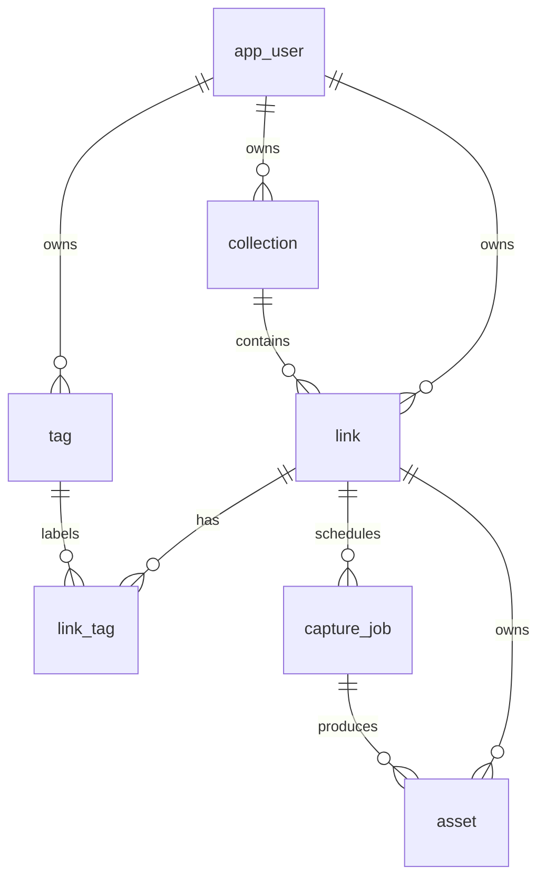

# 数据库设计

## 设计原则

- MySQL 是业务事实来源，Redis 不保存不可恢复的唯一业务状态。
- 所有用户数据都带 `user_id` 或通过链接关系可追溯到用户。
- 任务、资产与链接分开建模，支持重试、版本和失败审计。
- 时间统一保存为 UTC，前端按本地时区展示。

## ER 图



## 表结构

### app_user

- `id BIGINT PRIMARY KEY AUTO_INCREMENT`
- `username VARCHAR(64) NOT NULL UNIQUE`
- `email VARCHAR(255) NULL UNIQUE`
- `password_hash VARCHAR(100) NOT NULL`
- `created_at DATETIME(3) NOT NULL`
- `updated_at DATETIME(3) NOT NULL`

### collection

- `id BIGINT PRIMARY KEY AUTO_INCREMENT`
- `user_id BIGINT NOT NULL`
- `name VARCHAR(100) NOT NULL`
- `description VARCHAR(500) NOT NULL DEFAULT ''`
- `is_inbox TINYINT(1) NOT NULL DEFAULT 0`
- `created_at`、`updated_at`
- `UNIQUE KEY uk_collection_user_name (user_id, name)`
- `FOREIGN KEY (user_id) REFERENCES app_user(id) ON DELETE CASCADE`

每个用户只能有一个 Inbox；通过业务事务保证，不额外使用可空唯一索引技巧。

### link

- `id BIGINT PRIMARY KEY AUTO_INCREMENT`
- `user_id BIGINT NOT NULL`
- `collection_id BIGINT NOT NULL`
- `original_url VARCHAR(4096) NOT NULL`
- `normalized_url VARCHAR(4096) NOT NULL`
- `url_hash CHAR(64) CHARACTER SET ascii COLLATE ascii_bin NOT NULL`
- `title VARCHAR(500) NOT NULL DEFAULT ''`
- `description VARCHAR(2000) NOT NULL DEFAULT ''`
- `meta_description VARCHAR(500) NULL`
- `favicon_url VARCHAR(2048) NULL`
- `text_content MEDIUMTEXT NULL`
- `last_captured_at DATETIME(3) NULL`
- `created_at`、`updated_at`
- `UNIQUE KEY uk_link_user_url (user_id, url_hash)`
- `KEY idx_link_collection_created (collection_id, created_at DESC)`
- `FULLTEXT KEY ft_link_content (title, description, text_content) WITH PARSER ngram`

### tag

- `id BIGINT PRIMARY KEY AUTO_INCREMENT`
- `user_id BIGINT NOT NULL`
- `name VARCHAR(64) NOT NULL`
- `created_at`、`updated_at`
- `UNIQUE KEY uk_tag_user_name (user_id, name)`

### link_tag

- `link_id BIGINT NOT NULL`
- `tag_id BIGINT NOT NULL`
- `created_at DATETIME(3) NOT NULL`
- `PRIMARY KEY (link_id, tag_id)`
- 两个外键均使用 `ON DELETE CASCADE`

### capture_job

- `id BIGINT PRIMARY KEY AUTO_INCREMENT`
- `link_id BIGINT NOT NULL`
- `requested_by BIGINT NOT NULL`
- `status ENUM('PENDING','RUNNING','SUCCEEDED','FAILED') NOT NULL`
- `attempt_count TINYINT UNSIGNED NOT NULL DEFAULT 0`
- `max_attempts TINYINT UNSIGNED NOT NULL DEFAULT 3`
- `next_attempt_at DATETIME(3) NOT NULL`
- `locked_by VARCHAR(100) NULL`
- `locked_until DATETIME(3) NULL`
- `started_at DATETIME(3) NULL`
- `finished_at DATETIME(3) NULL`
- `error_code VARCHAR(64) NULL`
- `error_message VARCHAR(1000) NULL`
- `created_at`、`updated_at`
- `KEY idx_job_claim (status, next_attempt_at, id)`
- `KEY idx_job_recovery (status, locked_until)`
- `KEY idx_job_link_created (link_id, created_at DESC)`

### asset

- `id BIGINT PRIMARY KEY AUTO_INCREMENT`
- `link_id BIGINT NOT NULL`
- `job_id BIGINT NOT NULL`
- `asset_type ENUM('HTML','PDF','SCREENSHOT','READABLE') NOT NULL`
- `storage_path VARCHAR(512) NOT NULL`
- `mime_type VARCHAR(128) NOT NULL`
- `size_bytes BIGINT UNSIGNED NOT NULL`
- `sha256 CHAR(64) CHARACTER SET ascii COLLATE ascii_bin NOT NULL`
- `created_at DATETIME(3) NOT NULL`
- `UNIQUE KEY uk_asset_job_type (job_id, asset_type)`
- `KEY idx_asset_link_type_created (link_id, asset_type, created_at DESC)`

## 任务领取 SQL

```sql
START TRANSACTION;

SELECT id
FROM capture_job
WHERE status = 'PENDING'
  AND next_attempt_at <= NOW(3)
ORDER BY next_attempt_at, id
LIMIT 1
FOR UPDATE SKIP LOCKED;

UPDATE capture_job
SET status = 'RUNNING',
    attempt_count = attempt_count + 1,
    locked_by = ?,
    locked_until = DATE_ADD(NOW(3), INTERVAL 5 MINUTE),
    started_at = NOW(3)
WHERE id = ?;

COMMIT;
```

## 约束与清理

- 删除用户：级联删除集合、链接、标签、任务和资产记录。
- 删除集合：第一版禁止删除 Inbox；其他集合中的链接必须先移动或确认级联删除。
- 文件不是数据库事务的一部分，资产记录提交失败时由补偿任务清理孤儿文件。
- `RUNNING` 超过 `locked_until` 的任务由恢复调度器重新放入 `PENDING`。

