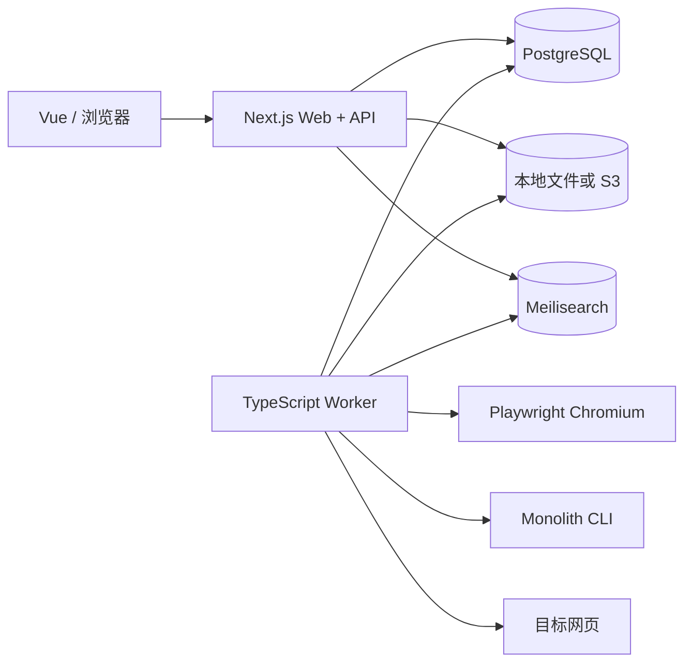

# Linkwarden v2.16.3 全景架构

## 它解决的真实问题

网页链接会失效、内容会变化、普通书签只保存 URL，无法回答“当初看到的内容是什么”。Linkwarden 的核心价值不是收藏链接，而是把链接变成可长期访问的本地副本，并围绕副本提供整理、阅读、标注、协作和检索能力。

第一版我们只迁移这个核心：保存 URL、异步生成副本、整理和检索。

## 仓库形态

上游是 Yarn 4 workspace 单仓库：

- `apps/web`：Next.js Web UI 与 `/api/v1` 接口。
- `apps/worker`：独立运行的 TypeScript worker。
- `apps/extension`：浏览器扩展。
- `apps/mobile`：React Native 移动端。
- `packages/prisma`：Prisma schema、迁移和数据库客户端。
- `packages/filesystem`：本地文件系统与 S3 的统一抽象。
- `packages/lib`：SSRF 防护、安全抓取、Meilisearch 客户端、公共工具。
- `packages/router`：Web 与移动端共享的路由和业务动作。
- `packages/types`：跨应用共享类型。

我们的 Java/Vue 版本只对应 `web + worker + prisma + filesystem + lib` 的主要职责，不迁移扩展、移动端、计费和协作。

## 运行组件

- PostgreSQL 是业务事实来源。
- 文件系统抽象根据环境选择本地目录或 S3。
- Meilisearch 是派生索引，不是权限和业务事实来源。
- Worker 通过轮询数据库中的状态标记发现待处理链接，不依赖独立消息队列。
- Playwright Chromium 负责真实页面渲染、截图和 PDF；Monolith 负责把页面及资源打包为单个 HTML。

## 关键边界

- Web 请求线程只做校验、权限检查、创建记录和快速查询，不执行耗时的网页抓取。
- Worker 承担耗时、易失败、可重试的保存任务。
- 数据库字段 `lastPreserved` 表示保存完成状态，`indexVersion` 表示检索索引是否过期。
- 上游把截图、PDF、HTML、Readability JSON 的路径直接放在 `Link` 模型中；我们的 Java 版本改用独立 `asset` 表，便于版本、哈希、类型和失败恢复。
- 上游的 worker 是轮询式而非队列式。它简单直接，但没有显式任务租约、重试次数和失败原因表；我们的版本计划使用 `capture_job` 表补齐这些能力。

## 安全边界

- 保存前只允许 `http` 和 `https`。
- 域名解析后检查 IPv4/IPv6 私网、回环、链路本地和保留网段，降低 SSRF 风险。
- `safeFetch` 手动处理重定向，每一跳都重新校验目标 URL。
- Playwright 页面请求经过路由拦截，再通过安全抓取代发，避免浏览器绕过服务端检查。
- 大文件通过缓冲上限、超时和 AbortSignal 限制资源消耗。

