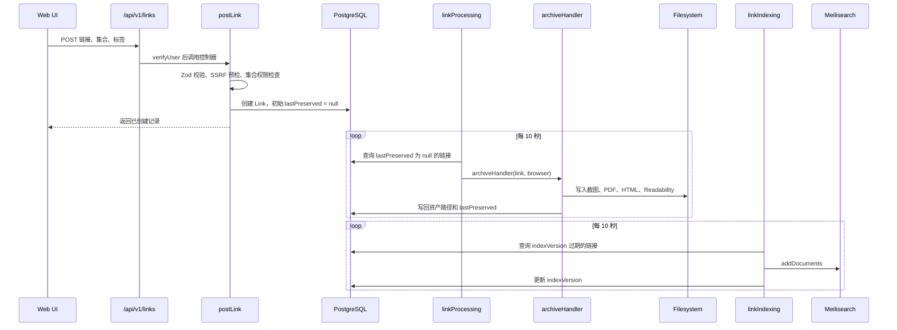

# Linkwarden v2.16.3 核心调用链

## 保存链接

## 创建阶段

`apps/web/pages/api/v1/links/index.ts` 接收 `GET/POST/PUT/DELETE`，先执行 `verifyUser`，再把请求交给对应控制器。

`postLink` 的主要动作：

1. 使用 Zod 校验请求和 URL 类型。
2. 调用 SSRF 预检，决定是否允许服务端保存。
3. 解析或创建用户可访问的集合。
4. 按用户配置检查重复链接和容量限制。
5. 快速请求标题与响应头，推断 URL、PDF 或图片类型。
6. 在同一业务流程中创建 `Link`、标签和目录。
7. 对安全 URL 保持 `lastPreserved = null`，使 Worker 稍后领取。
8. 对不安全 URL 直接写入 `unavailable`，避免无限等待。

## 保存阶段

`apps/worker/workers/linkProcessing.ts` 启动后循环执行：

1. `getLinkBatchFairly` 按用户公平挑选待处理链接。
2. 根据配置创建或复用 Playwright Browser。
3. 一批链接通过 `Promise.allSettled` 并发处理，单个失败不打断整批。
4. `archiveHandler` 创建独立 BrowserContext，并为页面请求安装安全路由。
5. 根据内容类型执行图片保存、PDF 保存或完整网页保存。
6. 网页保存按需执行预览、Readability、截图、PDF、Monolith 和 Wayback。
7. `finally` 中写回 `lastPreserved`，缺失格式写成 `unavailable`。

浏览器生命周期有两种模式：

- `persistent`：常驻浏览器，最长 30 分钟后轮换。
- `on-demand`：有任务时启动，空闲 60 秒后关闭。

## 资产生成

- Preview：读取 `og:image`，失败后截取首屏小图。
- Screenshot：自动滚动页面后生成全页 JPEG。
- PDF：通过 Playwright `page.pdf` 生成固定页面尺寸的 PDF。
- Readability：使用 Mozilla Readability 抽取正文，DOMPurify 清理 HTML，保存 JSON 和纯文本。
- Monolith：把页面与静态资源打包成单个 HTML 文件。
- Image/PDF URL：直接安全下载原始资源。

## 索引与搜索

`linkIndexing` 查询 `indexVersion` 过期或为空的链接，组合集合、标签和权限字段后写入 Meilisearch，最后更新 `indexVersion`。

搜索请求先由 Meilisearch 返回命中的 ID，再回 PostgreSQL 查询完整记录并重新执行可访问集合检查。这体现了一个重要原则：派生索引可以负责相关性排序，但权限判断必须回到业务数据库。

