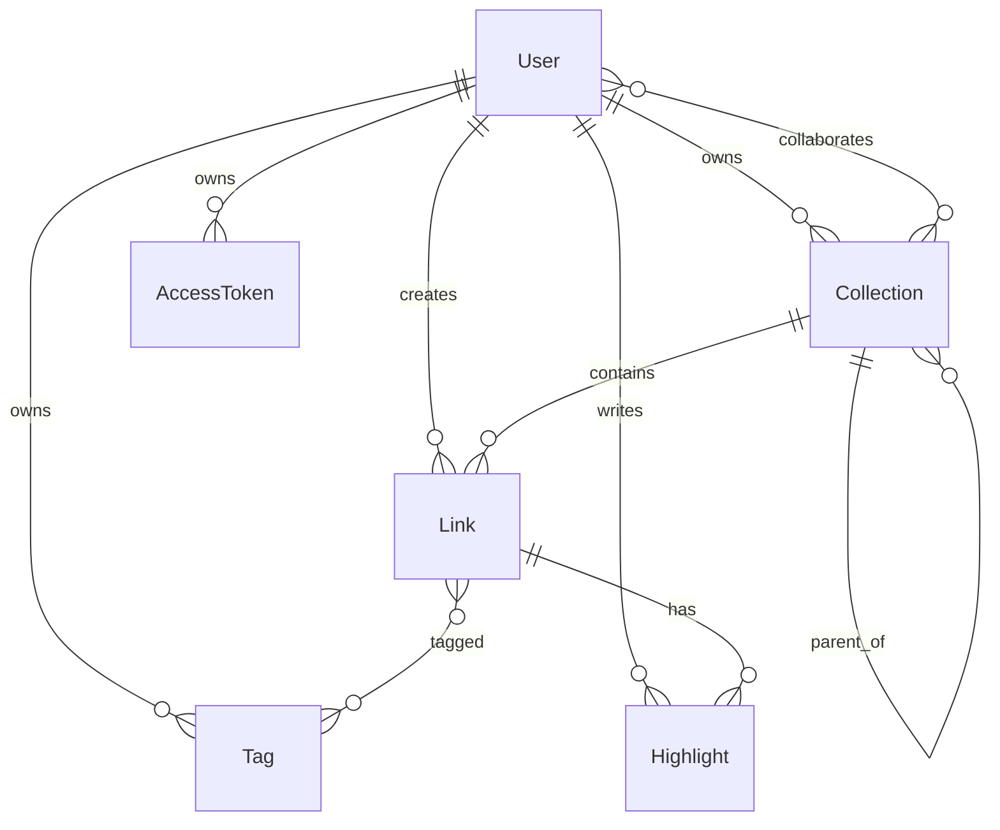

# Linkwarden v2.16.3 数据模型

## 核心实体

## 第一版相关的上游模型

- `User`：账号、偏好、保存格式开关、主题和订阅关系。
- `Collection`：名称、描述、颜色、父子集合、公开状态、所有者和成员。
- `UsersAndCollections`：用户与集合的多对多协作关系，包含 `canCreate/canUpdate/canDelete`。
- `Link`：名称、描述、URL、类型、集合、标签、预览、截图、PDF、Readable、Monolith、正文文本和索引版本。
- `Tag`：按 `name + ownerId` 唯一，并能覆盖部分保存设置。
- `Highlight`：正文高亮、注释和偏移位置。
- `AccessToken`：API Token 和会话。
- `AppMigration`：应用级迁移状态。

## 上游设计的重点

- `Link` 保存了多种派生格式的路径，读取展示方便，但一个链接的资产版本、失败原因和完整性没有独立建模。
- `lastPreserved` 同时承担“处理状态”和“最后完成时间”两个语义。
- `indexVersion` 把检索索引当作可重建的派生数据。
- `getLinkBatchFairly` 使用 `lastPickedAt` 在用户之间轮转，避免一个大账号长期占满 Worker。
- 上游没有独立任务表，因此没有强制的重试次数、租约超时和失败分类。

## 我们的映射与改进

- `User`、`Collection`、`Link`、`Tag` 保留核心关系和所有权字段。
- 去掉 `Subscription`、协作权限、RSS、Dashboard 和复杂个性化字段。
- 将资产路径从 `Link` 拆到 `Asset` 表，支持 HTML、PDF、截图的不同版本、SHA-256 和 MIME。
- 新增 `CaptureJob` 表，显式记录 `PENDING/RUNNING/SUCCEEDED/FAILED`、重试次数、下次执行时间和错误。
- `lastPreserved` 只表示最后一次成功保存时间；处理状态统一由 `CaptureJob` 表达。
- 第一版使用 `FULLTEXT ... WITH PARSER ngram`，不建立 Meilisearch 同步状态字段。

