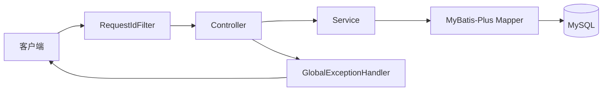

# 2026-09-14-003 阶段 1.2：基础设施与统一响应

## 元信息

- 编号：003
- 日期：2026-09-14
- 阶段：1.2 基础设施
- 状态：1.2A 已完成，1.2B1 进行中，1.2B2 待实现

## 目标

让 Spring Boot 后端能够按环境加载配置、连接本地 MySQL 和 Redis、执行 Flyway，并建立后续接口统一使用的响应、错误、请求 ID 和健康检查基础。

## 检查点 1.2A：配置与基础设施

用户亲手实现：

- `application-local.yml`：连接本地 Compose 的 MySQL `localhost:3307` 和 Redis `localhost:6380`。
- `application-api.yml`：API 进程端口和 Web 运行配置。
- `application-test.yml`：测试环境的连接占位配置；后续由 Testcontainers 注入实际地址。
- 数据库连接池、连接超时、Flyway、MyBatis-Plus 和 Redis 的基础配置。
- 通过环境变量覆盖数据库和 Redis 凭据，不在配置中提交真实密码。

验收：

1. MySQL 和 Redis 容器健康。
2. 使用 `local,api` profile 启动后端。
3. 应用启动期间不出现数据源、Flyway 或 Redis 配置错误。
4. MySQL 可以访问 `webcollector` 数据库，Redis 可以执行带密码的 `PING`。
5. 暂不创建用户表，暂不实现业务接口。

验收结果：已完成。启动 `local,api` 后成功连接 MySQL，Flyway 识别到空 schema，Tomcat 监听 8080；移除用户级 `SPRING_DATA_REDIS_PASSWORD` 覆盖后，`/actuator/health` 返回 `UP`。`application-test.yml` 保持为空，等待 Testcontainers 阶段处理。

## 检查点 1.2B1：统一成功响应与请求 ID

用户亲手实现：

- `ApiResponse<T>`：成功响应包含 `data`、`message`、`requestId`。
- `RequestIdFilter` 与请求上下文：优先读取 `X-Request-Id`，否则生成 UUID，并写入响应头。
- 日志格式加入 `requestId`，保证同一请求的日志能够关联。

验收：

1. 正常响应包含 `data`、`message` 和 `requestId`。
2. 客户端传入合法 `X-Request-Id` 时原样返回。
3. 客户端不传时自动生成 UUID。
4. 日志中可以看到同一条请求的 `requestId`。
5. Filter 执行完成后清理 `ThreadLocal` 和 MDC，避免线程复用污染。

当前结果：`RequestIdContext` 和 `RequestIdFilter` 已实现，6 个测试通过。`ApiResponse<T>` 仍为空类，日志格式尚未显式加入 `requestId`。

## 检查点 1.2B2：统一错误与健康检查

用户亲手实现：

- `ErrorResponse`：错误响应包含 `code`、`message`、`details`、`requestId`。
- `ErrorCode`：统一定义参数错误、未认证、资源不存在、冲突和内部错误。
- `BusinessException` 与 `GlobalExceptionHandler`：业务异常和未知异常使用一致协议返回。
- `HealthController` 或 Actuator 健康组：提供 `/api/v1/health/live` 和 `/api/v1/health/ready`。
- `MybatisPlusConfig`：注册分页插件和基础 Mapper 扫描配置。

验收：

1. 参数校验失败返回 `400` 和统一错误结构。
2. 未处理异常返回 `500`，但不泄漏堆栈和数据库细节。
3. `/api/v1/health/live` 在应用运行时返回成功。
4. `/api/v1/health/ready` 在 MySQL/Redis 可达时成功，不可达时返回失败状态。

## 请求链路

## 配置边界

- Java 代码只读取 Spring 配置，不直接读取 `.env` 文件。
- `.env` 只供 Docker Compose 使用；应用通过环境变量或 profile 配置获取连接信息。
- 本地默认凭据只能存在于示例和本地配置中，不能进入正式部署提交。
- `application-test.yml` 不连接固定数据库；Testcontainers 测试负责提供真实连接。

## 本阶段不做

- `app_user` 表和 Flyway 用户迁移。
- 注册、登录、退出和 Sa-Token 拦截器。
- 集合、链接、标签、任务和资产业务。
- Vue 前端。
