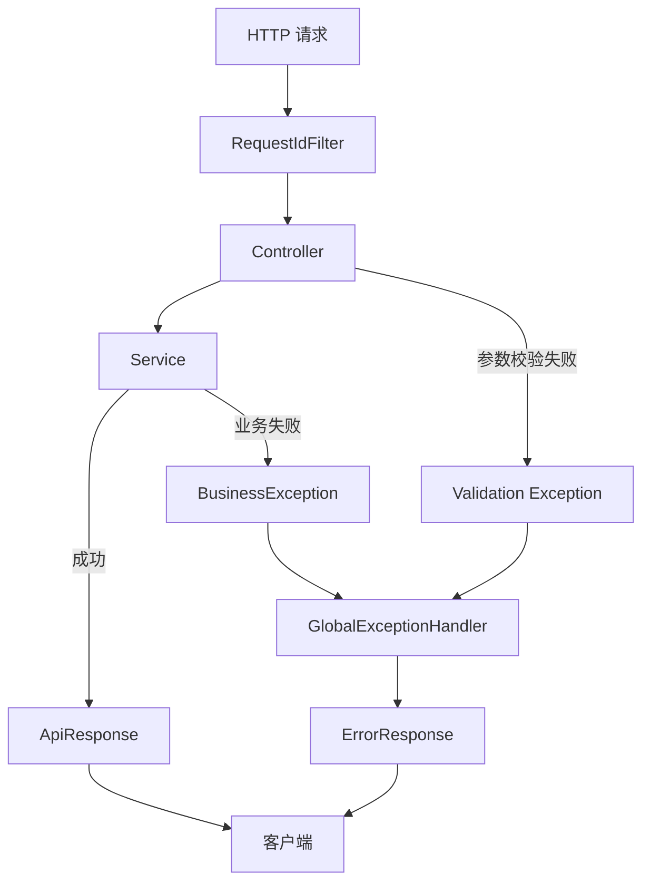

# 2026-09-17-004 阶段 1.2B2：统一错误与健康检查

## 元信息

- 编号：004
- 日期：2026-09-17
- 阶段：1.2B2
- 状态：1.2B2.1、1.2B2.2、1.2B2.3 已完成

## 本阶段目标

在统一成功响应的基础上，建立稳定的错误协议、异常转换规则和健康检查入口。目标是让所有 API 在失败时返回相同的结构，并让客户端能够用 `code` 和 `requestId` 定位问题。

本阶段不实现用户、集合、链接等业务表，也不接入 Sa-Token 登录拦截器。

## 子阶段

### 1.2B2.1 错误数据协议

先实现两个不依赖 Spring MVC 的基础类型：

- `ErrorCode`：错误码、HTTP 状态码和默认消息的单一来源。
- `ErrorResponse`：错误响应的数据结构和工厂方法。

暂不实现异常处理器，这样可以先独立测试错误结构。

验收结果：已完成。`ErrorCode` 使用枚举统一维护错误码、HTTP 状态和默认消息；`ErrorResponse` 通过私有构造器和工厂方法统一生成响应，并对 `details` 做空值规范化和不可变快照。新增 2 个 `ErrorCodeTest`、5 个 `ErrorResponseTest`，当时全部 17 个测试通过。

### 1.2B2.2 异常转换

实现：

- `BusinessException`：业务代码主动抛出的可预期异常。
- `GlobalExceptionHandler`：把不同异常转换成统一 `ErrorResponse`。

需要覆盖参数校验、非法请求、业务异常和未知异常。未知异常只记录服务器日志，不把异常堆栈、SQL 或内部类名返回给客户端。

验收结果（1.2B2.2A）：已完成。`BusinessException` 可以直接携带 `ErrorCode`、业务消息和安全 details；`GlobalExceptionHandler` 能通过 `@RestControllerAdvice` 将其转换为对应 HTTP 状态和 `ErrorResponse`。新增 3 个 `BusinessExceptionTest`、2 个 `GlobalExceptionHandlerTest`，当时全部 22 个测试通过。

验收结果（1.2B2.2B）：已完成。全局异常处理器覆盖请求体字段校验、约束异常、JSON 解析失败、参数类型转换失败和未知异常；未知异常只记录带 requestId 的完整服务器日志，客户端只收到安全的 `INTERNAL_ERROR` 响应。`GlobalExceptionHandlerTest` 扩展到 7 个 MockMvc 测试，当时全部 27 个测试通过。

### 1.2B2.3 健康检查与 MyBatis-Plus 配置

实现：

- `GET /api/v1/health/live`：只表示进程存活。
- `GET /api/v1/health/ready`：检查 MySQL 和 Redis 是否可到达。
- `MybatisPlusConfig`：注册 MySQL 分页拦截器；Mapper 扫描在实际 Mapper 出现后补充。

验收结果：已完成。`/api/v1/health/live` 返回进程存活的统一成功响应，不访问外部依赖；`/api/v1/health/ready` 检查 MySQL 连接有效性和 Redis `PING`，任一依赖不可用时返回 HTTP 503 和 `SERVICE_UNAVAILABLE`，并保留另一依赖的检查结果。`MybatisPlusConfig` 已注册 MySQL 分页拦截器。新增 `HealthControllerTest` 3 个、`HealthCheckServiceTest` 4 个、`MybatisPlusConfigTest` 1 个测试，阶段验收时为 35 个测试全部通过。

后续扩展（截至 2026-09-27）：阶段 1.4A 新增 `AUTH_REQUIRED` 和 `NotLoginException` 映射，阶段 1.4B1/B2 新增 MyBatis-Plus 映射、注册 DTO 与输入规范化。当前全量测试为 55 项通过；本节下面的错误码表和异常映射表已补入后续落地的鉴权条目，表中会明确区分原始阶段与后续扩展。

真实手工验证：Docker Compose 中 MySQL 8.4 和 Redis 7.4 均达到 `healthy` 后，应用成功启动；`live` 返回 `UP`，`ready` 返回 `mysql=UP`、`redis=UP`。排查过程中发现用户级 `SPRING_DATA_REDIS_PASSWORD` 会覆盖 `application-local.yml`，该问题已记录到排错笔记。

## 统一错误响应

```json
{
  "code": "VALIDATION_ERROR",
  "message": "请求参数不合法",
  "details": {
    "password": "长度必须在 8 到 72 之间"
  },
  "requestId": "7f4f4d7a-..."
}
```

字段职责：

- `code`：稳定、机器可判断的错误码；不要把中文提示当错误码。
- `message`：给用户或调用方看的简短说明。
- `details`：字段级错误或其他可安全公开的补充信息；没有时返回空对象 `{}`。
- `requestId`：由 `RequestIdContext` 提供，与响应头和服务器日志关联。

第一版 `details` 使用 `Map<String, String>`。如果未来同一字段需要多条错误，再升级为结构化的错误明细列表。

## 错误码与 HTTP 状态

| 错误码 | HTTP | 使用场景 |
| --- | ---: | --- |
| `VALIDATION_ERROR` | 400 | 请求字段校验失败 |
| `INVALID_REQUEST` | 400 | JSON 无法解析、参数类型错误 |
| `UNAUTHORIZED` | 401 | 未登录或 Token 无效 |
| `AUTH_REQUIRED` | 401 | 受保护接口缺少有效登录会话；阶段 1.4A 新增 |
| `FORBIDDEN` | 403 | 已认证但无权访问 |
| `NOT_FOUND` | 404 | 目标资源不存在 |
| `CONFLICT` | 409 | 用户名、URL 等唯一约束冲突 |
| `INTERNAL_ERROR` | 500 | 未预期的服务器异常 |
| `SERVICE_UNAVAILABLE` | 503 | 数据库、Redis 等关键依赖不可用 |

`code` 决定业务语义，HTTP 状态码决定协议层语义，两者必须同时正确。

## 异常映射规则

| 异常 | 错误码 | HTTP | 响应细节 |
| --- | --- | ---: | --- |
| `BusinessException` | 异常携带的 `ErrorCode` | 对应状态 | 使用异常携带的安全 details |
| `NotLoginException` | `AUTH_REQUIRED` | 401 | 不回显 Sa-Token 内部原因；阶段 1.4A 新增 |
| `MethodArgumentNotValidException` | `VALIDATION_ERROR` | 400 | 字段名到校验消息 |
| `ConstraintViolationException` | `VALIDATION_ERROR` | 400 | 参数路径到校验消息 |
| `HttpMessageNotReadableException` | `INVALID_REQUEST` | 400 | 不返回底层解析异常 |
| `MethodArgumentTypeMismatchException` | `INVALID_REQUEST` | 400 | 参数名称到类型说明 |
| `Exception` | `INTERNAL_ERROR` | 500 | details 为空，服务器记录完整异常 |

未知异常日志必须包含 `requestId`，响应必须隐藏敏感信息。

## 健康检查语义

- `live` 只检查应用进程是否还能处理请求，不依赖 MySQL 或 Redis。
- `ready` 检查应用是否具备处理核心业务所需的外部依赖。
- 依赖可用时返回 HTTP 200 和统一成功响应。
- 依赖不可用时返回 HTTP 503 和统一错误响应，错误码为 `SERVICE_UNAVAILABLE`。

## 调用链


```mermaid
flowchart TD
  Request[HTTP 请求] --> Filter[RequestIdFilter]
  Filter --> Controller[Controller]
  Controller --> Service[Service]
  Service -->|成功| Success[ApiResponse]
  Service -->|业务失败| Business[BusinessException]
  Controller -->|参数校验失败| Validation[Validation Exception]
  Business --> Handler[GlobalExceptionHandler]
  Validation --> Handler
  Handler --> Error[ErrorResponse]
  Success --> Client[客户端]
  Error --> Client
```

## 验收标准

1. 参数校验失败返回 HTTP 400，响应包含 `VALIDATION_ERROR`、字段 details 和当前 `requestId`。
2. 业务异常返回对应 HTTP 状态和错误码。
3. 未处理异常返回 HTTP 500，但不泄漏堆栈、SQL 或内部实现细节。
4. 所有错误响应都包含 `code`、`message`、`details`、`requestId`。
5. `/api/v1/health/live` 不依赖 MySQL 和 Redis，应用可处理请求时返回成功。
6. `/api/v1/health/ready` 在 MySQL/Redis 可用时返回成功，不可用时返回 503。
7. 新增错误协议测试，并保持阶段 1.2B1 的测试全部通过。

## 本阶段当时的边界与后续状态

- 用户表和鉴权拦截器：`app_user` 在阶段 1.3 落地；Sa-Token 的 Redis DAO 和未登录异常映射在阶段 1.4A 落地，完整的注册、登录、`/me`、退出接口尚未完成。
- 具体业务资源的权限判断。
- 国际化错误消息。
- 自定义复杂健康指标。
- 多层微服务异常传播。
