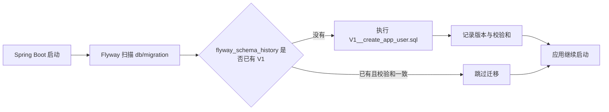

# 2026-09-20-005 阶段 1.3：用户表与 Flyway 迁移

## 元信息

- 编号：005
- 日期：2026-09-20
- 阶段：1.3
- 状态：已完成

## 本阶段目标

建立第一张业务表 `app_user`，作为后续注册、登录、集合、链接和资产归属关系的身份根节点。

本阶段只负责数据库迁移：

- 新增 `backend/src/main/resources/db/migration/V1__create_app_user.sql`。
- 启动应用时由 Flyway 自动执行迁移。
- 验证表结构、唯一约束、字符集和时间字段。
- 不实现注册、登录、当前用户和退出接口。

## 现实问题

系统必须回答“这条数据属于谁”。如果用户身份没有稳定的主键，后续的集合、链接、标签和采集任务就无法建立可靠的所有权边界。

`app_user` 只保存认证所需的最小数据：

- 身份：`id`。
- 登录名：`username`。
- 可选联系方式：`email`。
- 密码凭证：`password_hash`，永远不保存明文密码。
- 生命周期时间：`created_at`、`updated_at`。

## Flyway 调用链



迁移文件一旦在真实数据库执行，就不再修改。后续结构变化必须新增 `V2__...sql`，因为 Flyway 会校验已执行文件的内容是否发生变化。

## 表结构契约

### 字段

| 字段 | 类型 | 约束 | 设计理由 |
| --- | --- | --- | --- |
| `id` | `BIGINT` | 主键、自增、非空 | 稳定且与业务含义无关的身份主键 |
| `username` | `VARCHAR(32)` | 非空、唯一 | 登录名；业务层校验长度为 3 到 32 |
| `email` | `VARCHAR(254)` | 可空、唯一 | 邮箱可选；空字符串应在业务层规范化为 `NULL` |
| `password_hash` | `VARCHAR(100)` | 非空 | 保存 BCrypt 等密码哈希，不保存明文密码 |
| `created_at` | `DATETIME(3)` | 非空 | 创建时间，由应用按 UTC 语义写入 |
| `updated_at` | `DATETIME(3)` | 非空 | 最近更新时间，由应用按 UTC 语义写入 |

### 约束

- 主键约束名称使用 MySQL 自动生成的 `PRIMARY`。
- 用户名唯一索引命名为 `uk_app_user_username`。
- 邮箱唯一索引命名为 `uk_app_user_email`。
- MySQL 唯一索引允许多个 `NULL`，因此可选邮箱不会互相冲突。
- 表使用 `InnoDB`、`utf8mb4` 和 `utf8mb4_0900_ai_ci`。
- `username` 和 `email` 默认不区分大小写；登录和重复检查必须在同一规则下规范化。

### 时间决策

第一阶段使用 `DATETIME(3)`，由 Java 业务代码明确写入 UTC 时间，不依赖 MySQL 容器的本地时区。

不在本迁移中使用 `DEFAULT CURRENT_TIMESTAMP`，避免把“时间由应用控制”和“时间由数据库控制”两种策略混在一起。后续实现实体时，可以用 MyBatis-Plus 自动填充或 Service 显式赋值。

## 用户手写任务

1. 在 IDEA 中创建目录 `backend/src/main/resources/db/migration/`。
2. 新建文件 `V1__create_app_user.sql`，文件名中的 `V1` 和双下划线必须准确。
3. 使用 `CREATE TABLE app_user (...)` 实现上述字段和约束。
4. 为每个字段补充简短 SQL 注释或单独说明，解释它解决什么问题。
5. 先不要修改 `application-local.yml`、Java 实体、Mapper 或鉴权代码。

## 验收结果

- 迁移文件已正确定名为 `V1__create_app_user.sql`。
- `flyway_schema_history` 已记录 `version=1`、`description=create app user`、`success=1`、`checksum=71230801`。
- `SHOW CREATE TABLE app_user` 已确认主键、用户名唯一索引、邮箱唯一索引、`utf8mb4_0900_ai_ci` 和 `DATETIME(3)` 字段。
- 用户名重复和邮箱重复均在数据库层返回 `ERROR 1062`。
- 两条不同的 `email = NULL` 记录可以同时存在。
- 约束验证使用事务并回滚，验证后没有留下 `codex_review_%` 测试数据。
- `mvn -pl backend test` 结果为 `35` 个测试通过。
- `live` 返回 `status=UP`，`ready` 返回 `mysql=UP`、`redis=UP`。
- MySQL 客户端在当前 PowerShell 中显示表注释为 `?????`，但 `TABLE_COMMENT` 的十六进制为 `E794A8E688B7E8B4A6E58FB7E8A1A8`，与“用户账号表”的 UTF-8 字节一致，属于终端显示编码问题，不是数据库内容损坏。

## 验收标准

1. `mvn -pl backend test` 仍全部通过。
2. Docker Compose 中 MySQL 8.4 处于 `healthy`。
3. 启动应用时，Flyway 成功执行 `V1`，没有 SQL 语法或约束错误。
4. `flyway_schema_history` 中存在成功记录 `version=1`。
5. `SHOW CREATE TABLE app_user` 能看到主键、两个唯一索引和正确的字段类型。
6. 重复用户名和重复非空邮箱在数据库层被拒绝。
7. 多个 `email = NULL` 的记录可以同时存在，空邮箱规则由后续业务层处理。

## 后续实现状态（2026-09-27）

- `AppUser` 和 `AppUserMapper` 已在阶段 1.4B1 实现，MyBatis-Plus 根据 `id` 自增策略完成主键回写。
- `RegisterRequest`、`UserSummary` 和 `AuthInputNormalizer` 已在阶段 1.4B2 实现，用户名、邮箱规范化和 DTO 校验已有单元测试。
- BCrypt `PasswordEncoder Bean` 已在阶段 1.4A 准备完成，但注册服务尚未调用它完成真实落库。
- 本节后续状态只补充后续实现事实，不改变 1.3 验收时的历史测试数量。

## 手工验证命令

```powershell
docker compose -f deploy/local/docker-compose.yml up -d
docker compose -f deploy/local/docker-compose.yml ps
mvn -pl backend spring-boot:run
```

应用启动成功后，在新的 PowerShell 窗口执行：

```powershell
docker exec -it webcollector-mysql mysql `
  -uwebcollector `
  -pwebcollector_dev `
  webcollector `
  -e "SELECT version, description, success FROM flyway_schema_history;"

docker exec -it webcollector-mysql mysql `
  -uwebcollector `
  -pwebcollector_dev `
  webcollector `
  -e "SHOW CREATE TABLE app_user\G"
```

## 本阶段当时的边界与后续状态

- 本阶段当时不创建 `User` Java 实体；阶段 1.4B1 已创建 `AppUser`。
- 本阶段当时不创建 Mapper、Service 或 Controller；阶段 1.4B1 已创建 `AppUserMapper`，注册 Service 和 Controller 已在 `1.3`（旧 `1.4.3`）完成。
- 本阶段当时不实现 BCrypt 密码哈希；阶段 1.4A 已提供 `PasswordEncoder` Bean，实际注册调用已在 `1.3`（旧 `1.4.3`）完成。
- 本阶段当时不实现 Sa-Token 登录和退出；阶段 1.4A 已完成 Redis 持久化 DAO 和基础设施，登录与退出接口仍待 1.4C。
- 不建立集合、链接、标签、任务或资产表。
- 不修改 `reference/linkwarden/`，不复制上游迁移或代码。
