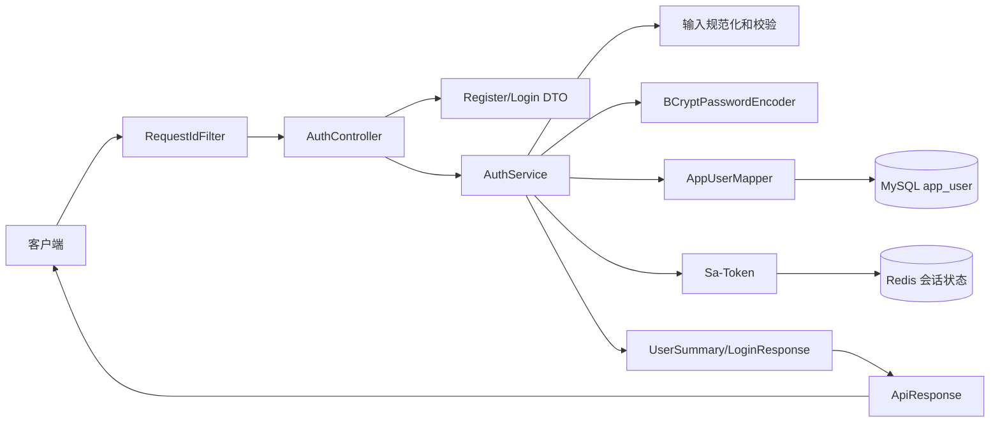
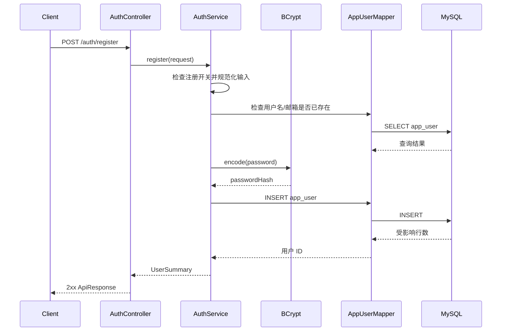
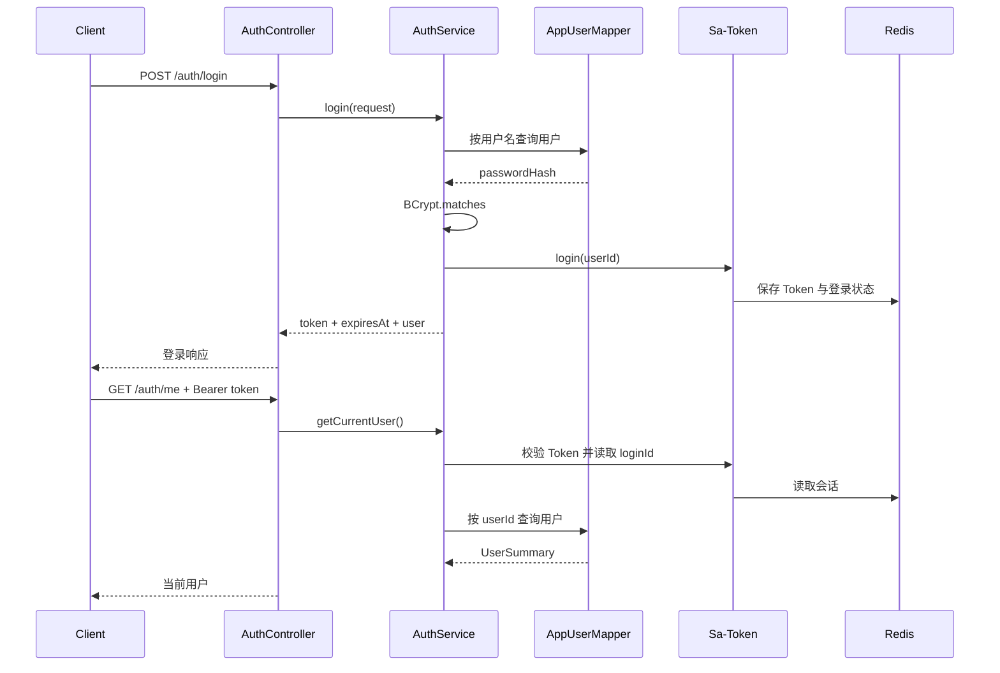
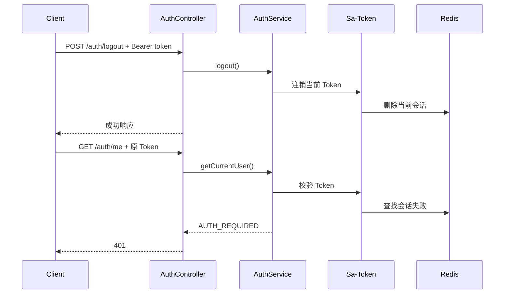

# 2026-09-21-006 阶段 1.4：鉴权闭环

## 元信息

- 编号：006
- 日期：2026-09-21
- 阶段：1.4
- 状态：`1.4.1`、`1.4.2`、`1.4.3` 已完成并通过验收；`1.4.4` 待开始

## 本阶段目标

在 `app_user` 表基础上实现四个后端鉴权接口，形成可运行的账号闭环：

- `POST /api/v1/auth/register`
- `POST /api/v1/auth/login`
- `GET /api/v1/auth/me`
- `POST /api/v1/auth/logout`

完成标准不是“接口能返回结果”，而是：

1. 注册时密码只以 BCrypt 哈希形式落库。
2. 登录成功后客户端能使用 `Authorization: Bearer <token>` 访问受保护接口。
3. 未登录或 Token 无效时，受保护接口返回 `401 AUTH_REQUIRED`。
4. 退出后，原 Token 立即不能继续访问 `/me`。
5. 用户名和邮箱的输入规范化、唯一约束和并发冲突都有明确行为。
6. 测试覆盖成功链路、失败链路、Token 失效和敏感信息不泄漏。

本阶段不生成 Vue 页面，不实现集合、链接、任务和资产接口。

## 现实问题

系统后续所有资源都要回答“这条集合/链接/任务属于谁”。鉴权层的职责是先建立可信的当前用户身份，再把用户 ID 交给后续业务层。

鉴权不是一个单独的密码比较函数，而是四段连续问题：

1. 注册：如何把用户输入转换成可持久化、不可逆、可唯一识别的账号记录。
2. 登录：如何证明请求者知道正确密码，并签发一个有生命周期和撤销语义的凭证。
3. 鉴权：如何从后续请求中恢复当前用户身份，并拒绝伪造、过期或已退出的凭证。
4. 退出：如何让服务端停止承认当前凭证，而不是只在浏览器端假装“删掉了登录状态”。

## Token 方案选择

### 方案 A：Redis 持久化的 Sa-Token 会话 Token（推荐）

- Token 是不透明字符串，不作为用户信息的自包含载体。
- Redis 保存 Token 与登录用户 ID、会话状态的映射。
- `logout` 删除服务端会话，因此原 Token 立即失效。
- 应用重启后，只要 Redis 数据仍在，登录状态可以恢复。
- 不把密码、邮箱等敏感信息放进 Token。
- 需要新增 `sa-token-redis-jackson`，不再需要 `sa-token-jwt`。

代价：每次鉴权需要访问 Redis；这是为了获得明确的注销语义。

### 方案 B：JWT + Redis 会话/黑名单

- JWT 自带签发时间、过期时间和签名，适合学习 Token 结构和无状态验证。
- 纯 JWT 本身无法在退出时立即失效，仍需要 Redis 黑名单、版本号或混合会话状态。
- 需要使用 `StpLogicJwtForMixin` 或自行维护撤销状态，配置和测试复杂度更高。
- 适合明确想学习 JWT 的情况，但不应该把它误解为“用了 JWT 就没有状态”。

### 方案 C：Sa-Token 默认内存 DAO

- 实现最简单，但应用重启后会话消失，多实例无法共享。
- 与本项目已经准备的 Redis 基础设施不匹配。
- 不作为正式方案；最多可用于临时验证接口。

### 已确认决策

采用方案 A：使用 Redis 持久化的 Sa-Token 会话 Token。先保证 MVP 的鉴权和注销语义正确，把 JWT 作为后续可替换的认证实现练习，而不是在 1.4 同时承担两套状态模型。

## 子阶段拆分

### 1.4A 鉴权基础设施

- 引入 Sa-Token 的 Redis 持久化集成。
- 配置 `Authorization: Bearer`、Token 过期时间和会话策略。
- 创建 `PasswordEncoder`，使用 BCrypt。
- 创建 `AuthProperties`，读取 `app.auth.registration-enabled`。
- 注册 `NotLoginException` 到统一错误响应的映射。
- 只做基础设施验证，不实现四个业务接口。

验收：应用能连接 Redis；测试 Token 登录、读取和注销时，Redis 中的会话状态随操作变化；未登录异常能转成 `401 AUTH_REQUIRED`。

实施清单：

- `backend/pom.xml`：移除未使用的 `sa-token-jwt`，增加 `cn.dev33:sa-token-redis-jackson:1.46.0`。
- `backend/src/main/resources/application.yml`：增加全局 `sa-token` 配置和 `app.auth.registration-enabled: false`。
- `backend/src/main/resources/application-local.yml`：将本地 `app.auth.registration-enabled` 设为 `true`。
- `com.webcollector.auth.config.AuthProperties`：读取 `app.auth.registration-enabled`。
- `com.webcollector.auth.config.AuthConfig`：提供 `BCryptPasswordEncoder` Bean。
- `ErrorCode`：增加鉴权错误码，至少包含 `AUTH_REQUIRED`。
- `GlobalExceptionHandler`：将 `NotLoginException` 转换为 `401 AUTH_REQUIRED`。
- Redis 集成测试：验证 Sa-Token DAO 的写入、读取、TTL、删除行为；不实现注册和登录业务接口。

实施记录（2026-09-23）：

- [x] `backend/pom.xml`：`sa-token-jwt` 替换为 `sa-token-redis-jackson:1.46.0`，并固定 `testcontainers.version=1.21.4`。
- [x] `application.yml`：全局关闭注册（`app.auth.registration-enabled: false`），配置 `Authorization` + `Bearer`、7200 秒有效期、只读 Header、UUID Token。
- [x] `application-local.yml`：本地开启注册（`registration-enabled: true`）。
- [x] `AuthProperties`：绑定 `app.auth.registration-enabled`。
- [x] `AuthConfig`：提供 `BCryptPasswordEncoder`，只暴露 `PasswordEncoder` 接口。
- [x] `ErrorCode.AUTH_REQUIRED`：HTTP 401，默认消息“请先登录”。
- [x] `GlobalExceptionHandler.handleNotLoginException`：把 Sa-Token 的 `NotLoginException` 转换为 `401 AUTH_REQUIRED`，不回显 Sa-Token 内部消息。
- [x] `SaTokenRedisIntegrationTest`：使用真实 MySQL 8.4 + Redis 7.4 容器验证 Flyway 迁移和 `SaTokenDaoForRedisTemplate` 的写入、读取、TTL、删除。
- [x] `AuthConfigTest`、`ErrorCodeTest`、`GlobalExceptionHandlerTest`：覆盖密码哈希、错误码映射和未登录响应契约。
- 验证结果（1.4A 验收时）：`mvn -pl backend test` 共 40 个测试通过（`Tests run: 40, Failures: 0, Errors: 0, Skipped: 0`）。

尚未完成的验收项（属于 1.4B/1.4C）：注册后密码哈希落库、登录签发 Token、`/me` 访问、退出后 Token 失效。本轮只提交可复用的鉴权基础设施，不把后续业务接口算作已完成。

Redis 学习观察点：

- Redis 中的值是“会话状态”，不是浏览器缓存；退出必须改变服务端状态。
- Sa-Token 可能为一次登录写入多个键，不要假设只有一个键。
- 使用 `SCAN` 或 `redis-cli --scan` 观察本地键；不要在生产代码或生产运维脚本中使用阻塞式的 `KEYS *`。
- 使用 `TTL <key>` 观察过期时间，理解 TTL 到期与主动注销是两条不同的失效路径。

### 1.4B 用户映射与注册

- 创建 `AppUser` 实体、`AppUserMapper`。
- 创建注册请求和用户摘要 DTO。
- 实现用户名/邮箱规范化、重复检查和 BCrypt 哈希。
- 实现注册开关和数据库唯一约束冲突处理。

验收：注册成功后数据库没有明文密码；重复用户名、重复邮箱、空邮箱和非法密码都有确定结果。

实施记录（2026-09-27）：

- [x] 1.4B1：`AppUser` 实体（`@TableName("app_user")`、`@TableId(type = IdType.AUTO)`）与 `AppUserMapper extends BaseMapper<AppUser>`；`MybatisPlusConfig` 增加 `@MapperScan("com.webcollector.**.mapper")`，启动日志不再出现 `No MyBatis mapper was found`。
- [x] 1.4B1：`AppUserMapperTest` 用真实 MySQL 验证插入后主键回写、按主键查回全部字段、以及用户名唯一索引拒绝重复（同一测试内把第二个用户的邮箱设为不同值，以隔离变量）。
- [x] 1.4B2：`AuthInputNormalizer` 提供 `normalizeUsername` / `normalizeEmail`；使用 `strip()` 而非 `trim()`，邮箱小写化固定用 `Locale.ROOT`，空白邮箱规范化为 `null`。
- [x] 1.4B2：`RegisterRequest` 使用 record + `@NotBlank` / `@Size` / `@Email`，并在紧凑构造器中完成规范化，使校验发生在规范化之后；`password` 刻意不做任何规范化。
- [x] 1.4B2：`UserSummary` 只暴露 `id` / `username` / `email` / `createdAt`，从类型上排除 `passwordHash` 泄漏。
- [x] 1.4B2：`AuthInputNormalizerTest` 6 个 + `RegisterRequestValidationTest` 7 个测试通过，全量测试 55 个通过。

实施记录（2026-10-07，`1.4.3`）：

- [x] `AuthService`：实现注册开关、用户名/邮箱重复检查、BCrypt 哈希、`Clock` 时间写入和 `DuplicateKeyException` 到 `409` 的转换。
- [x] `AuthController`：实现 `POST /api/v1/auth/register`，使用 `@Valid` 校验请求，成功返回 `201 Created` 和统一 `ApiResponse`。
- [x] `AuthControllerTest`：覆盖成功注册、字段校验、注册关闭、用户名冲突、邮箱冲突和非法 JSON。
- [x] `AuthRegistrationIntegrationTest`：使用真实 MySQL、Redis、BCrypt、`AuthService` 和 MockMvc，验证用户真实落库、密码哈希和重复冲突。
- [x] `UserSummary.createdAt`：使用 ISO 8601 字符串输出，避免 `Instant` 被 Jackson 序列化为数字时间戳。
- [x] 全量测试：`mvn -pl backend test` 当前 70 项通过。

### 1.4C 登录、当前用户与退出

- 实现登录、`/me`、退出。
- 登录失败使用统一凭证错误消息。
- `/me` 根据 Sa-Token 登录 ID 查询用户摘要。
- 退出执行 Sa-Token 注销，重复退出保持幂等。

验收：登录返回 Token 和过期时间；Token 可以访问 `/me`；退出后原 Token 立即失效。

### 1.4D 测试与归档

- 补齐单元测试和 Testcontainers 集成测试。
- 用真实 MySQL、Redis 手工验证完整鉴权链路。
- 更新接口文档、技术笔记、排错记录和阶段验收记录。
- 形成独立的阶段 commit。

## 接口契约

### 注册

`POST /api/v1/auth/register`

请求：

```json
{
  "username": "student",
  "email": "student@example.com",
  "password": "correct-horse-battery-staple"
}
```

成功响应：

```json
{
  "data": {
    "id": 1,
    "username": "student",
    "email": "student@example.com",
    "createdAt": "2026-09-21T12:00:00Z"
  },
  "message": "注册成功",
  "requestId": "..."
}
```

规则：

- `username`：去除首尾空白后长度为 3 到 32。
- `password`：长度 8 到 72；只保存 BCrypt 哈希。
- `email`：可省略；空字符串规范化为 `null`；非空时去空白、转小写并校验邮箱格式。
- 用户名和邮箱的比较遵循数据库 `utf8mb4_0900_ai_ci` 的大小写不敏感规则。
- 注册关闭时返回 `403 REGISTRATION_DISABLED`。
- 用户名或邮箱冲突返回 `409`，不能把数据库异常原样暴露给客户端。

### 登录

`POST /api/v1/auth/login`

请求：

```json
{
  "username": "student",
  "password": "correct-horse-battery-staple"
}
```

成功响应：

```json
{
  "data": {
    "token": "opaque-token",
    "tokenName": "Authorization",
    "expiresAt": "2026-09-21T14:00:00Z",
    "user": {
      "id": 1,
      "username": "student",
      "email": "student@example.com"
    }
  },
  "message": "登录成功",
  "requestId": "..."
}
```

规则：

- 用户名不存在和密码错误都返回同一个 `401 AUTH_INVALID_CREDENTIALS`。
- 成功登录后由 Sa-Token 建立服务端会话。
- 响应中的 `expiresAt` 是 UTC ISO 8601 时间。
- 响应绝不包含 `password_hash`。

### 当前用户

`GET /api/v1/auth/me`

请求头：

```text
Authorization: Bearer <token>
```

成功时返回当前用户摘要。无 Token、Token 过期、Token 被注销或 Token 无对应登录状态时，返回 `401 AUTH_REQUIRED`。

### 退出

`POST /api/v1/auth/logout`

规则：

- 当前 Token 存在且有效时，使其服务端会话失效。
- 已退出、Token 已过期或请求未携带有效 Token 时，重复调用仍返回成功。
- 退出接口不承担“证明当前用户是谁”的业务职责；它只清理当前凭证。

## 分层职责



- `Controller`：只负责 HTTP 参数绑定、调用 Service 和包装统一成功响应。
- `Service`：负责业务规则、事务、规范化、密码比较、登录和退出。
- `Mapper`：只负责 SQL 映射，不包含认证规则。
- `AppUser`：只映射数据库字段，不直接作为 HTTP 响应对象。
- `DTO/Record`：约束请求和响应边界，避免暴露 `passwordHash`。
- `GlobalExceptionHandler`：把可预期业务异常和 Sa-Token 未登录异常转换为统一错误响应。

## 关键数据流

### 注册



数据库唯一索引是最终防线。即使两个请求同时通过了“先查询”，也只能有一个 `INSERT` 成功，另一个必须转换为 `409`。

### 登录与访问



### 退出



## 输入规范化与安全规则

### 用户名

- 使用 `@NotBlank`、`@Size(min = 3, max = 32)`。
- 去除首尾空白后再写入和查询。
- 不依赖“先查询一定没有并发”的假设，唯一索引是最终保障。
- 登录和注册必须使用相同的大小写比较语义。

### 邮箱

- 使用 `@Email` 和长度上限 `254`。
- `null`、空字符串、仅空白字符串统一存为 `null`。
- 非空时去掉首尾空白并转小写。
- 多个 `null` 邮箱可以同时存在；非空邮箱冲突由唯一索引拒绝。

### 密码

- 使用 `@NotBlank`、`@Size(min = 8, max = 72)`。
- 只使用 `BCryptPasswordEncoder`，不自行实现密码算法。
- 日志和响应中绝不打印原始密码或密码哈希。

### Token

- 只从 `Authorization` 请求头读取，不读取 Cookie 或请求体。
- 固定格式：`Bearer <token>`。
- Token 不写入日志；需要排查时只记录请求 ID。
- 退出后删除服务端会话，不使用“客户端删除本地 Token”替代注销。

## 错误码建议

在现有 `ErrorCode` 基础上增加或确认以下错误码：

| 错误码 | HTTP | 含义 |
| --- | ---: | --- |
| `AUTH_REQUIRED` | 401 | 缺失、过期或无效 Token |
| `AUTH_INVALID_CREDENTIALS` | 401 | 用户名或密码错误 |
| `REGISTRATION_DISABLED` | 403 | 当前环境未开放注册 |
| `USERNAME_ALREADY_EXISTS` | 409 | 用户名已存在 |
| `EMAIL_ALREADY_EXISTS` | 409 | 邮箱已被使用 |

`AUTH_REQUIRED` 在 1.4A 落地；`REGISTRATION_DISABLED`、`USERNAME_ALREADY_EXISTS` 和 `EMAIL_ALREADY_EXISTS` 在 1.4.3 落地。`AUTH_INVALID_CREDENTIALS` 留到 1.4.4 登录与退出实现，不提前定义未使用的枚举值。

## 测试计划

### 单元测试

- 注册关闭时抛出 `REGISTRATION_DISABLED`。
- 用户名去空白、邮箱空值规范化和邮箱小写化。
- 密码只通过 `PasswordEncoder` 哈希，哈希不等于明文。
- 密码错误和用户不存在返回同一个凭证错误。
- 退出调用 Sa-Token 注销，重复退出不抛出错误。

### MockMvc / Web 层测试

- 注册请求字段校验失败时返回 `400 VALIDATION_ERROR`。
- 注册成功返回用户摘要且不包含 `passwordHash`。
- 未登录访问 `/me` 返回 `401 AUTH_REQUIRED`。
- 登录成功返回 `token`、`expiresAt` 和用户摘要。
- 退出后原 Token 访问 `/me` 返回 `401`。

### Testcontainers 集成测试

- MySQL 执行 Flyway `V1`。
- Redis 作为 Sa-Token 会话存储。
- 注册、登录、`/me`、退出使用真实数据库和 Redis 完成一条链路。
- 重复用户名、重复邮箱和并发唯一冲突返回 `409`。

## 本轮验收清单

- [x] Token 方案已由用户确认为方案 A。
- [x] `mvn -pl backend test` 全部通过；截至 2026-10-07 为 70 项通过。
- [x] 注册后 `app_user.password_hash` 为 BCrypt 哈希。
- [ ] 登录后可访问 `/api/v1/auth/me`。
- [ ] `/auth/me` 在无 Token、错误 Token、退出后的 Token 下均返回 `401 AUTH_REQUIRED`。
- [ ] `/auth/logout` 重复调用不报错。
- [x] 注册响应中不出现原始密码或 `password_hash`。
- [x] `docs/工程化文档/06-接口设计.md` 已更新注册接口实际契约。
- [x] 技术笔记、排错笔记和阶段验收记录已更新。

## 本阶段不做

- 不生成 Vue 登录页。
- 不实现刷新 Token、记住我、验证码和第三方登录。
- 不实现密码重置、邮箱验证和双因素认证。
- 不实现用户资料修改。
- 不实现集合、链接、标签、任务和资产权限。
- 不修改 `reference/linkwarden/`，不复制 Linkwarden 代码或资源。
