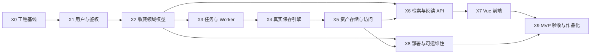

# 2026-10-07-007 X 级阶段路线图与分工

## 元信息

- 编号：007
- 日期：2026-10-07
- 阶段：项目级路线图
- 状态：已确认
- 适用边界：Web 收藏与内容保存系统 MVP，不覆盖第一版明确不做的协作、公开分享、移动端和 AI 标签。

## 文档目的

这份文档回答三个问题：

1. 项目在 MVP 范围内可以划分为哪些 X 级大阶段。
2. 每个 X 级阶段解决什么现实问题，交付什么可运行结果。
3. 用户、Codex 和双方共同验收在每个阶段分别负责什么。

## 编号规则

从阶段 1.4 起使用三段式编号：

```text
X.Y.Z
```

含义：

- `X`：大阶段，表示一个相对独立的能力域。
- `Y`：阶段内的业务阶段或子问题。
- `Z`：该阶段中的一个可验收增量。

规则：

- 一个 `Z` 可以包含多个实现任务和测试任务，但只形成一个阶段级验收记录。
- 不再使用 `1.4B3.1` 这类十进制、字母和点号混排的编号。
- 历史文档和 Git 历史不强制修改；旧编号通过本索引进行映射。
- X 级阶段的顺序体现依赖关系，不表示所有阶段都必须串行等待前一个阶段百分之百完成；但某个阶段的核心输入必须稳定后才能进入下一阶段。

## 当前编号映射

| 新编号 | 旧编号 | 内容 | 状态 |
| --- | --- | --- | --- |
| `1.4.1` | 1.4A | 鉴权基础设施 | 已完成 |
| `1.4.2` | 1.4B1、1.4B2 | 用户映射、注册 DTO 与输入规范化 | 已完成 |
| `1.4.3` | 1.4B3.1、1.4B3.2 | AuthService、AuthController 与注册接口测试 | 进行中 |
| `1.4.4` | 1.4C | 登录、当前用户与退出 | 未开始 |
| `1.4.5` | 1.4D | 鉴权阶段测试与归档 | 未开始 |

旧阶段 `0`、`1.1`、`1.2`、`1.3` 归入 `X0`；旧阶段 `1.4` 归入 `X1`。旧阶段 `2` 至 `7` 分别映射到后续 X 级阶段，X4/X5、X8/X9 是对原计划中“真实保存”和“部署验收”能力的进一步拆分。

## 阶段依赖



关键依赖说明：

- X1 依赖 X0 的配置、迁移、统一响应和测试基线。
- X2 依赖 X1 提供可信的当前用户身份。
- X3 依赖 X2 创建链接后留下稳定的任务入口。
- X4 依赖 X3 提供可抢占、可重试的任务调度。
- X5 依赖 X4 产出真实资产文件。
- X6 依赖 X2 的链接元数据，以及 X5 的资产元数据和文件访问边界。
- X7 依赖 X1、X2、X3、X5、X6 形成稳定的 API 契约。
- X8 依赖 X2 和 X5 的核心数据与文件持久化能力。
- X9 依赖前九个阶段均有可运行结果、测试证据和可解释的设计。

## 阶段总览

| X 级阶段 | 目标 | 主要交付物 | 前置依赖 | 当前状态 |
| --- | --- | --- | --- | --- |
| `X0` | 让仓库、环境、配置和测试基线稳定 | Maven、profile、MySQL、Redis、Flyway、统一响应、健康检查 | 无 | 已完成 |
| `X1` | 建立可信用户身份和会话边界 | 注册、登录、当前用户、退出、Sa-Token + Redis 会话 | X0 | 进行中 |
| `X2` | 让用户能组织和保存收藏元数据 | collection、tag、link、所有权隔离、URL 规范化、待处理任务 | X1 | 未开始 |
| `X3` | 让采集任务可靠地异步执行 | capture_job 状态机、抢占、锁超时、重试、假 Worker | X2 | 未开始 |
| `X4` | 让 URL 真正转化为网页快照 | Playwright、HTML、PDF、截图、正文抽取、SSRF 防护 | X3 | 未开始 |
| `X5` | 让资产安全、可追踪地持久化 | asset 表、文件路径、MIME、SHA-256、授权读取、清理 | X4 | 未开始 |
| `X6` | 让用户能搜索并阅读保存内容 | ngram 检索、过滤、分页、清理后的阅读视图 | X2、X5 | 未开始 |
| `X7` | 让用户通过完整 UI 使用系统 | Vue 登录、集合、链接、任务轮询、详情、标签、搜索 | X1、X2、X3、X5、X6 | 未开始 |
| `X8` | 让系统可以部署、运行和恢复 | Docker Compose、Nginx、数据卷、健康检查、备份、限流 | X2、X5 | 未开始 |
| `X9` | 证明 MVP 可用并形成作品证据 | 30 个网页验收、性能报告、运维说明、复盘、`v0.1.0` | X0-X8 | 未开始 |

## 统一分工约定

### 用户负责

- 亲手实现后端业务代码、数据库迁移、Mapper、Service 和 Controller。
- 在编码前参与阶段目标、数据流、接口和验收标准确认。
- 运行单元测试、集成测试和手工验收，记录真实失败。
- 编写和整理项目中的学习观察，能够解释关键设计取舍。
- 对技术选型和影响学习目标的取舍作出最终决定。

### Codex 负责

- 讲解架构、调用链、设计模式、Java/Spring 语法和 408 知识关联。
- 拆解可验收增量，给出接口、数据模型、失败路径和测试建议。
- 审查用户的代码，重点检查职责边界、事务、安全、并发和异常处理。
- 从 `X7` 开始生成 Vue 前端，并逐组件解释数据流和状态管理。
- 整理 PRD、工程化文档、技术笔记、排错笔记、复盘和交付说明。

### 双方共同负责

- 共同确认阶段目标、范围、接口契约、状态码和验收标准。
- 共同验证成功链路、失败链路、权限隔离和重启恢复。
- 每个 `Z` 增量必须留下可运行结果、测试或手工记录、文档更新和独立 commit。

## X0：工程基线与环境

### 目标

让项目从“空目录”变成一个可被 IDEA 理解、可构建、可连接本地依赖、可执行自动化测试的后端工程。

### 范围

- 仓库初始化、`main` 分支、Git 忽略规则和参考源码隔离。
- Maven 聚合工程和 `backend` 模块。
- Java 17、Spring Boot 3.x、MyBatis-Plus、Sa-Token、MySQL、Redis 基础依赖。
- `local`、`api`、`test` profile。
- Docker Compose 启动 MySQL 8.4 和 Redis 7.4。
- Flyway、统一响应、请求 ID、统一异常和 health live/ready。
- `app_user` 迁移和 Testcontainers 测试基线。

### 交付物

- `pom.xml` 和 `backend/pom.xml`。
- `deploy/local/docker-compose.yml`。
- 环境配置、Flyway 迁移、统一响应和健康检查。
- 可重复运行的测试命令和文档索引。

### 用户负责

- 配置 IDEA JDK、Maven、Docker 和本地 profile。
- 亲手实现配置、迁移、统一响应、异常处理和健康检查。
- 验证 Compose、Flyway、MySQL、Redis 和应用启动链路。

### Codex 负责

- 讲解 Spring profile、连接池、Flyway、Filter、统一响应和异常转换。
- 审查配置边界、密钥管理、线程清理和健康检查语义。
- 提供测试建议并整理环境、技术和排错文档。

### 共同验收

- `mvn -pl backend test` 通过。
- Compose 中 MySQL、Redis 健康。
- 应用可以启动，Flyway 成功执行，`live` 和 `ready` 语义正确。
- 仓库不提交密钥、运行数据、`.idea` 和参考源码。

### 学习目标

- Maven 多模块、Spring 配置绑定和 profile。
- 连接池、数据库连接、Redis 连接和最小权限。
- Filter、ThreadLocal、MDC 和线程复用。
- Flyway 版本迁移和数据库契约。
- 操作系统进程、端口、容器和网络健康检查。

### 明确不做

- 不实现注册、登录、集合、链接、任务、资产和前端。
- 不接入 Playwright 或真实网页。

## X1：用户与鉴权

### 目标

建立“当前请求属于哪个用户”的可信身份边界，让后续所有资源都能执行所有权判断。

### 范围

- `app_user` 实体、Mapper 和注册 DTO。
- BCrypt 密码哈希。
- Sa-Token + Redis 持久化会话。
- 注册、登录、当前用户和退出。
- `Authorization: Bearer`、未登录错误和会话失效。
- 阶段需要的单元测试、MockMvc 测试和 Testcontainers 集成测试。

### 交付物

- `POST /api/v1/auth/register`。
- `POST /api/v1/auth/login`。
- `GET /api/v1/auth/me`。
- `POST /api/v1/auth/logout`。
- 认证错误码、接口文档、技术笔记和阶段验收记录。

### 用户负责

- 亲手实现 `AuthService`、`AuthController`、DTO、Mapper 和会话调用。
- 处理用户名/邮箱规范化、BCrypt、注册开关和唯一冲突。
- 验证注册、登录、`/me`、退出、Token 失效和敏感信息不泄漏。

### Codex 负责

- 讲解认证与授权的区别、会话 Token 和 JWT 的取舍。
- 审查事务边界、密码安全、异常翻译、响应状态码和会话语义。
- 提供 Controller、Service 和 Testcontainers 测试建议。

### 共同验收

- 注册只保存 BCrypt 哈希，不保存明文密码。
- 登录返回可用 Token 和过期时间。
- 有效 Token 可以访问 `/me`，无 Token、错误 Token 和退出后的 Token 返回 `401 AUTH_REQUIRED`。
- 用户名和邮箱冲突返回稳定的 `409` 业务错误。
- 注册成功使用 `201 Created`。

### 学习目标

- HTTP 状态码、REST 语义和统一错误协议。
- record、Bean Validation、构造器注入和 Strategy 模式。
- BCrypt、Redis TTL、会话持久化和注销语义。
- 事务边界、`@Transactional`、异常翻译和并发唯一约束。

### 明确不做

- JWT 替换实现、刷新 Token、记住我、验证码和第三方登录。
- 密码重置、邮箱验证和双因素认证。
- Vue 登录页。

## X2：收藏领域模型与 CRUD

### 目标

让用户能够创建、修改、组织和删除收藏元数据，同时保证所有资源都归属于当前用户。

### 范围

- `collection`：扁平集合和默认 Inbox。
- `tag`、`link` 和 `link_tag`。
- 链接原始 URL、规范化 URL、标题、描述、状态和搜索文本。
- 集合、链接、标签的 CRUD。
- URL 规范化、协议限制、去重和重复 URL 的 `409`。
- 保存链接时创建 `PENDING` 任务记录，但不执行抓取。

### 交付物

- 数据库迁移、ER 图、索引和唯一约束。
- 集合、链接、标签的接口契约和服务端 CRUD。
- 默认 Inbox 规则和所有权隔离测试。
- URL 规范化测试和重复 URL 测试。

### 用户负责

- 设计并实现实体、Mapper、Service、Controller 和迁移。
- 编写 URL 规范化、去重、默认 Inbox 和所有权测试。
- 手工验证不同用户之间不能互相读取或修改资源。

### Codex 负责

- 审查关系模型、索引、事务边界和 URL 规范化顺序。
- 检查所有权条件是否遗漏，避免越权查询。
- 提供接口文档和测试场景建议。

### 共同验收

- 新用户自动拥有默认 Inbox。
- 同一用户重复保存相同规范化 URL 返回 `409`。
- 不同用户拥有相同 URL 时互不冲突。
- 保存链接会生成一条 `PENDING` 任务，但不会触发真实抓取。

### 学习目标

- 关系数据库建模、外键、联合唯一索引和查询索引。
- 所有权隔离和“当前用户”到 SQL 条件的转换。
- URL 解析、规范化、哈希和幂等性。
- 事务脚本、Data Mapper 和 Service Layer。

### 明确不做

- 嵌套集合、分享、协作权限和公开链接。
- 真正的网页抓取、搜索索引和前端页面。

## X3：持久化任务与 Worker 状态机

### 目标

让保存请求从同步 HTTP 操作变成持久化、可抢占、可重试、可恢复的异步任务。

### 范围

- `capture_job` 表、状态迁移和任务索引。
- `PENDING → RUNNING → SUCCEEDED/FAILED`。
- `FOR UPDATE SKIP LOCKED` 抢占任务。
- Worker 锁、锁超时恢复和任务幂等。
- 失败最多重试 3 次、指数退避和错误信息记录。
- 手动重新采集和假处理器验证。

### 交付物

- capture job 数据模型和状态机文档。
- Worker profile、任务抢占服务和假处理器。
- 并发消费、重试、恢复和重复触发测试。

### 用户负责

- 亲手实现任务 Mapper、状态迁移和 Worker 调度。
- 编写并发抢占、锁超时和重试测试。
- 验证同一任务不会在两个 Worker 中被同时成功处理。

### Codex 负责

- 审查状态机、锁粒度、事务隔离、幂等和失败恢复。
- 绘制任务时序图，设计可控的假处理器测试。
- 整理并发、锁和重试知识到技术笔记。

### 共同验收

- 正常任务可以进入 `SUCCEEDED`。
- 可控失败可以进入 `FAILED`，并遵守最多 3 次重试。
- 超时锁可以被恢复，僵死任务不会永久占用。
- 并发 Worker 不会重复成功消费同一条任务。

### 学习目标

- 并发、临界区、锁、事务隔离和数据库行锁。
- 有界重试、指数退避和幂等设计。
- 状态机的合法迁移和非法迁移防御。
- 操作系统调度、进程和队列思想的真实关联。

### 明确不做

- Playwright 页面抓取和真实文件资产。
- Redis Stream 或 RabbitMQ 作为第一版事实队列。

## X4：真实网页保存引擎

### 目标

把用户提交的 URL 转化为可保存、可回看的 HTML、PDF、截图和正文文本。

### 范围

- Playwright Java 浏览器生命周期。
- 导航、等待、超时和页面关闭。
- HTML 原文件、PDF、截图和正文抽取。
- 重定向后的 SSRF 复检。
- localhost、私网、云元数据地址和非法协议拦截。
- 页面崩溃、浏览器超时和部分格式失败处理。

### 交付物

- 真实保存处理器和页面采集结果模型。
- SSRF 防护和资源限制。
- HTML、PDF、截图和正文生成的最小闭环。
- 真实网页夹具、本地 HTTP 测试服务和失败路径测试。

### 用户负责

- 亲手实现 Playwright 调用、页面校验和抓取流水线。
- 实现超时、大小限制、重定向复检和异常分类。
- 使用本地测试页面验证成功、超时、崩溃和私网拒绝。

### Codex 负责

- 讲解浏览器进程、HTTP、DNS、重定向和 SSRF 风险。
- 审查资源释放、超时、大小限制和部分失败策略。
- 提供真实网页夹具、测试场景和排错记录建议。

### 共同验收

- 合法公网 URL 至少生成一种资产。
- 私网 URL 在保存前或重定向后都被拒绝。
- 页面超时、浏览器崩溃和非法协议进入明确失败路径。
- Worker 不会因为单页面失败而永久占用或泄漏浏览器进程。

### 学习目标

- HTTP、DNS、TCP、代理和重定向。
- 浏览器进程生命周期、超时、资源限制和文件 I/O。
- 安全边界、SSRF 防护和内容安全。
- 失败分类、部分成功和可恢复性设计。

### 明确不做

- 绕过反爬、登录态网页、复杂 SPA 专项兼容。
- 多节点浏览器集群和云端浏览器服务。

## X5：资产存储与访问安全

### 目标

让采集产生的文件安全、可追踪、可授权访问，并能随链接生命周期清理。

### 范围

- `asset` 表：类型、相对路径、MIME、大小、SHA-256 和采集版本。
- 本地文件系统存储和 `AssetStorage` 抽象。
- 临时文件、原子移动、相对路径和目录隔离。
- `GET /assets/{id}` 和元数据接口的权限检查。
- 删除链接后的数据库记录删除和异步文件清理。
- HTML 下载语义和路径穿越防护。

### 交付物

- asset 迁移、实体、Mapper 和存储接口。
- 资产元数据、文件读取和授权访问接口。
- 文件哈希、大小、MIME 和清理测试。

### 用户负责

- 亲手实现资产持久化、文件读写和授权查询。
- 实现原子写入、哈希和删除清理策略。
- 验证无权限用户不能读取他人资产。

### Codex 负责

- 审查存储抽象、路径边界、读权限和事务/文件一致性问题。
- 提供路径穿越、部分写入和清理失败测试建议。
- 整理文件系统、哈希和 MIME 知识。

### 共同验收

- 数据库记录与文件元数据一致。
- SHA-256 与文件内容匹配。
- 无权限读取返回 `403` 或 `404`，不泄漏资源存在性。
- 文件写入失败不会留下半成品或覆盖旧资产。

### 学习目标

- 文件系统、目录权限、原子移动和资源释放。
- SHA-256、MIME、文件大小和内容完整性。
- 授权访问、路径穿越和资源清理。
- 数据库事务与文件系统副作用之间的边界。

### 明确不做

- MinIO、S3、CDN 和多节点共享存储。
- 公开资产直链和公开分享。

## X6：检索与阅读 API

### 目标

让用户能够通过标题、描述、正文、标签和集合快速找回收藏，并安全阅读清理后的正文。

### 范围

- MySQL 8 `FULLTEXT` 和 `ngram` 中英文检索。
- 标题、描述、抽取文本和标签参与检索。
- 集合、标签、时间过滤。
- 游标分页、排序和结果摘要。
- 清理后的阅读视图和原始链接入口。
- 搜索权限隔离和搜索结果元数据。

### 交付物

- 搜索索引迁移、搜索 Mapper 和接口。
- 阅读视图接口和 HTML 清理规则。
- 中英文检索、过滤、分页和越权测试。

### 用户负责

- 亲手实现搜索查询、过滤条件、分页和阅读 API。
- 验证中文、英文、空结果和越权场景。
- 记录查询计划、索引使用和慢查询初步观察。

### Codex 负责

- 审查 ngram 索引、查询条件、分页语义和权限隔离。
- 检查 HTML 清理、XSS 和外部资源风险。
- 提供搜索测试数据、查询解释和性能验证建议。

### 共同验收

- 中文标题和正文可检索。
- 英文标题和正文可检索。
- 集合、标签、时间过滤结果正确。
- 无权限用户无法通过搜索或阅读接口读取他人内容。

### 学习目标

- B+ 树、全文索引、ngram 和查询计划。
- 分页、排序、游标和数据一致性。
- HTML 清理、XSS 和内容渲染安全。
- 数据库查询与日常信息检索的联系。

### 明确不做

- Meilisearch、Elasticsearch、向量检索和 AI 问答。
- 复杂相关度排序和个性化推荐。

## X7：Vue 前端

### 目标

让用户通过完整 UI 完成登录、保存、等待任务、查看快照和搜索找回。

### 范围

- Vue 3、Vite、Pinia、Vue Router、Element Plus。
- 登录、集合侧栏、链接列表、添加链接、任务轮询和详情页。
- 标签管理、搜索页、错误态、加载态和空状态。
- Axios API 客户端和认证 Token 注入。
- 资产查看、阅读视图和任务状态展示。

### 交付物

- 前端工程和页面组件。
- API 客户端、Pinia store、路由和错误归一化。
- 组件数据流说明和手工验收记录。

### 用户负责

- 运行前端、联调 API、处理真实交互问题。
- 逐组件理解数据来源、状态变化和错误边界。
- 手工验收核心保存和找回闭环。

### Codex 负责

- 编写前端代码和组件。
- 逐组件讲解组件职责、状态流、路由和接口调用。
- 提供 UI 错误态、加载态和联调排错建议。

### 共同验收

- 登录后能够创建集合、保存 URL 并看到任务状态。
- 任务成功后能够查看元数据、快照和阅读视图。
- 标签管理和搜索能够完成闭环。
- 核心流程不需要阅读开发文档即可操作完成。

### 学习目标

- SPA、组件、Props/Events、路由和状态管理。
- HTTP 客户端、Token 注入、异步状态和错误处理。
- 前后端契约、联调、加载态和用户交互。
- 软件工程中的接口边界和用户反馈设计。

### 明确不做

- 移动端 App、浏览器扩展和 SSR。
- 协作权限、公开分享和 AI 交互界面。

## X8：部署、可运维性与安全

### 目标

让系统不只可以在 IDE 中运行，还可以通过自托管部署稳定运行、重启恢复和基础运维。

### 范围

- Docker Compose：API、Worker、MySQL、Redis、Nginx 和前端静态资源。
- 数据卷、环境变量、健康检查和启动顺序。
- Nginx 反向代理、静态资源和基础限流。
- 日志、备份、恢复和故障排查说明。
- 敏感配置、端口和访问边界。

### 交付物

- Compose、Nginx 和部署配置文件。
- 本地/自托管运行手册。
- 备份恢复说明、健康检查说明和故障处理记录。

### 用户负责

- 执行部署、验证服务启动和重启恢复。
- 检查环境变量、数据卷、端口和备份恢复结果。
- 记录部署中的真实问题和修复过程。

### Codex 负责

- 编写 Compose、Nginx 和运维说明。
- 审查配置安全、容器网络、卷挂载和启动依赖。
- 提供冷启动、重启、备份和故障注入验收方案。

### 共同验收

- 从干净环境可以启动完整系统。
- MySQL、Redis 和资产数据在容器重启后仍然存在。
- 健康检查能够区分存活和就绪。
- 不提交真实密码、Token、运行数据和个人配置。

### 学习目标

- 容器、镜像、网络、卷和进程管理。
- 反向代理、端口、DNS、HTTP 和健康检查。
- 配置管理、数据备份、恢复和最小权限。
- 软件工程中的可运维性和运行环境边界。

### 明确不做

- Kubernetes、云厂商托管服务和多区域高可用。
- 公网公开部署、计费和 SLA。

## X9：MVP 验收与作品化

### 目标

用真实数据证明 MVP 可用，并把项目转化为可复盘、可展示、可面试解释的工程作品。

### 范围

- 30 个不同真实网页的保存验收。
- 采集成功率、失败原因和完成耗时统计。
- 核心保存、搜索、阅读闭环的手工验收。
- 测试报告、需求索引、架构、数据库、接口和运维文档收口。
- 阶段复盘、项目总结和 `v0.1.0` 交付标记。
- 面向简历和面试的项目讲解材料。

### 交付物

- 30 个网页验收记录和统计数据。
- 最终测试报告、缺陷清单和修复记录。
- 项目复盘、技术笔记、排错笔记和 408 知识反哺。
- `v0.1.0` 发布说明和交付清单。

### 用户负责

- 亲自执行 30 个网页验收并记录真实结果。
- 解释架构、关键调用链、失败路径、并发和测试取舍。
- 汇总个人学习收获和后续改进方向。

### Codex 负责

- 制定验收表、统计口径和复盘模板。
- 审查最终文档、测试结果和项目讲述是否与代码一致。
- 协助整理作品化说明，但不替代用户理解项目。

### 共同验收

- 30 个不同网页采集成功率不低于 90%。
- 提交 URL 到快照可查看的中位时间不超过 30 秒。
- 失败任务保留错误原因，不删除已有资产。
- 核心保存、搜索和查看流程无需查阅文档即可完成。
- 所有核心文档和关键决策可追溯到实际代码与测试。

### 学习目标

- 验收测试、统计数据、性能指标和缺陷管理。
- 技术写作、架构表达、复盘和知识迁移。
- 将 Java、Spring、数据库、网络、操作系统和软件工程知识串成完整项目叙事。

### 明确不做

- 把 MVP 扩展成协作 SaaS、移动产品或 AI 内容平台。
- 用未实现的功能填充简历或验收报告。

## 当前状态快照（2026-10-07）

- `X0` 已完成。
- `X1` 进行中：`1.4.1`、`1.4.2` 已完成，`1.4.3` 注册接口进行中。
- `1.4.3` 当前已完成 `AuthService`，还需要完成 `AuthController`、Web 层测试和真实数据库注册链路验收。
- 当前全量测试为 `61` 项通过。
- `X2` 至 `X9` 尚未开始。

## 验收记录规则

- 每次完成一个 `Z` 编号，记录：可运行结果、测试命令、测试数量、手工验证、未完成项和 commit。
- 一个 `Z` 没有通过验收时，不把状态标记为“已完成”。
- 阶段文档只记录已经发生的事实；计划内容必须明确标注“计划”或“未开始”。
- 如果设计与实现发生偏离，先更新需求和架构文档，再继续编码。

## 后续扩展

以下内容不属于第一版 MVP，只有在 X0-X9 完成后才重新评估：

- 浏览器扩展。
- 多用户协作和公开分享。
- AI 标签、摘要和问答。
- RSS、SSO、移动端和云对象存储。
